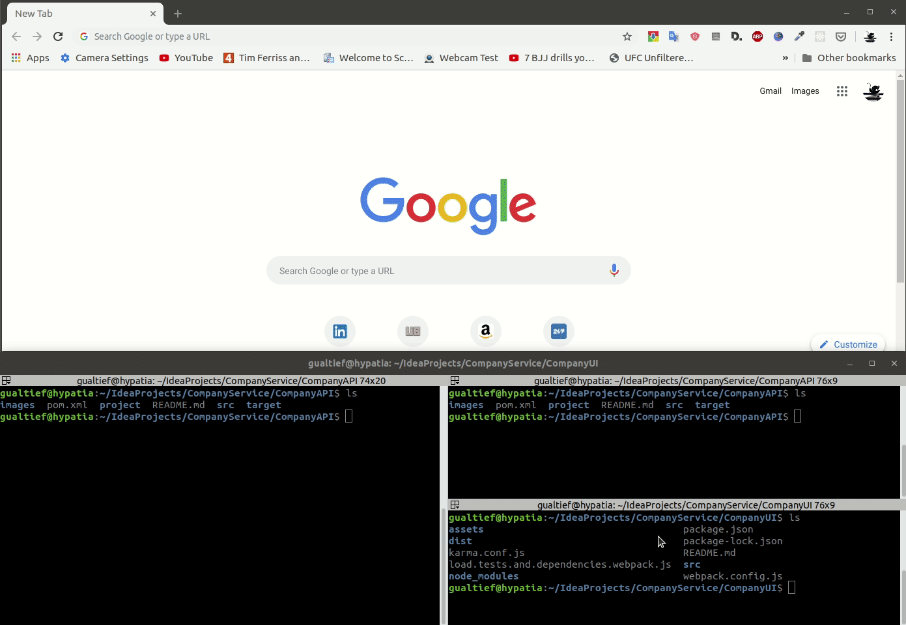

<!-- TOC depthFrom:1 depthTo:6 withLinks:1 updateOnSave:1 orderedList:0 -->

- [Company UI](#company-ui)
	- [Overview](#overview)
	- [Installing Dependencies](#installing-dependencies)
	- [Running Tests](#running-tests)
	- [Building the app](#building-the-app)
	- [Running the App](#running-the-app)
	- [Developer's Guide](#developers-guide)
	- [TODOS](#todos)

<!-- /TOC -->

# Company UI

## Overview

The purpose of this project is to showcase my skills with [React.js](https://reactjs.org/).

This project is an extension of the original "Company Service" project, which only consisted of a REST API built in Java using [Spring Boot](https://spring.io/projects/spring-boot). You can find more information on the API [here](../CompanyAPI).

This is a work in progress and at the moment only listing and updating companies are supported, but both of these features are complete (with corresponding automated tests).

## Installing Dependencies

This project has been created using [webpack](https://webpack.js.org/) for build management and thus requires [Node.js](https://nodejs.org/en/).

Once node is installed, execute the following command to install all other project's dependencies:

    npm install

## Running Tests

To run all unit tests, execute the following command:

    npm run test

You should get an output similar to the following:

    15 05 2019 11:39:23.671:INFO [karma-server]: Karma v4.1.0 server started at http://0.0.0.0:9876/
    15 05 2019 11:39:23.672:INFO [launcher]: Launching browsers Chrome with concurrency unlimited
    15 05 2019 11:39:23.675:INFO [launcher]: Starting browser Chrome
    15 05 2019 11:39:28.128:INFO [Chrome 74.0.3729 (Linux 0.0.0)]: Connected on socket xSUSWe2tasQGtWLhAAAA with id 7254250
      ListScreen
        ✔ shows error message when back-end responds with error status on loading
        ✔ loads data from the back-end
        ✔ renders without errors
        ✔ shows error message when fetch throws error on loading
      MessageBar
        ✔ has message text
        ✔ renders without errors
        ✔ has alert danger styling for error message
        ✔ has alert success styling for error message
      UpdateScreen
        ✔ shows success message when back-end responds with success status on update
        ✔ shows error message when back-end responds with error status on update
        ✔ loads company from the back-end
        ✔ shows error message when back-end responds with error status on loading
        ✔ shows error message when fetch throws error on loading
        ✔ makes update call to back-end on update
        ✔ renders without errors
        ✔ shows error message when fetch throws error on update
      FormInputText
        ✔ modifies model correctly
        ✔ renders without errors
      CompanyList
        ✔ has all headers
        ✔ renders without errors
        ✔ loads companies from back-end

    Finished in 0.505 secs / 0.442 secs @ 11:39:29 GMT+0200 (CEST)

    SUMMARY:
    ✔ 21 tests completed

Unit tests have been written in Jasmine, using [enzyme](https://airbnb.io/enzyme/) to check react components and [fetch-mock](http://www.wheresrhys.co.uk/fetch-mock/) to mock the client's calls to the back-end service.

Given that state and rendering updates in React.js are handled asynchronously, I'm also using [enzyme-async-helpers](https://github.com/zth/enzyme-async-helpers) for checking components in tests.

## Building the app

The following command will generate a fully deploy-able app under `./dist`:

    npm run build

## Running the App

To start the app in development mode, execute the following command:

    npm run start

The app will be available on the URL [`http://localhost:9000/`](http://localhost:9000/).

## Developer's Guide

You will find the following warning when running tests:

> DeprecationWarning: Tapable.plugin is deprecated. Use new API on `.hooks` instead

According with [this resource](https://github.com/webpack/webpack/issues/6568), that's a known issue with webpack and can be ignored.

Apparently there's no option to silence only this particular warning (only all warnings), so I'm leaving the warning message as it is.

## TODOS

- Replace the placeholders for remove and create with working components.
- Add support to updating the nested data in the forms (each company contains "owners", which is a list comprised of one of more owners).
- Investigate the use of [Jest](https://jestjs.io/) in the unit tests.
- Add coverage reports.
